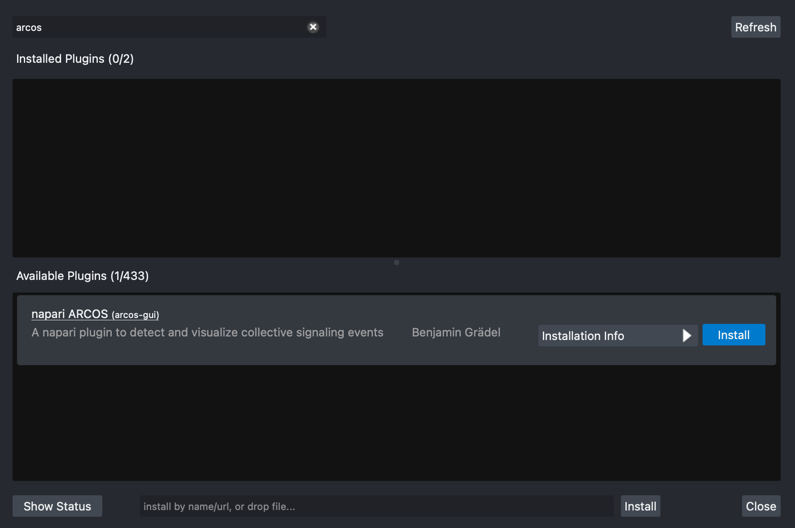

# napari-plugin-manager

[](https://github.com/napari/napari-plugin-manager/raw/main/LICENSE)
[](https://pypi.org/project/napari-plugin-manager)
[](https://python.org)
[](https://github.com/napari/napari-plugin-manager/actions/workflows/test_and_deploy.yml)
[](https://codecov.io/gh/napari/napari-plugin-manager)

[napari] plugin manager to provide a graphical user interface for installing
[napari] plugins.

You can read the documentation at https://napari.org/napari-plugin-manager

## Overview

The `napari-plugin-manager` used to be part of the [napari] package prior to version `0.4.5`, but it
was moved to a separate repository and package to allow for faster development cycles with a
dedicated team. Future work will allow other applications with a plugin ecosytem to customize and 
use the `plugin-manager`. This package remains under active development and contributions
are very welcome. Please open an issue to discuss potential improvements.

This package currently provides:

- A package installer process queue that supports both [pip] and [conda] installs.
- An easy to use GUI for searching, installing, uninstalling and updating plugins that make
  part of the napari ecosystem. Each plugin provides a summary and information on the authors that
  created the package. The rest API used to query for plugins and plugin information 
  is provided by the [npe2api service](https://api.napari.org).
- The ability to install other packages via url of by draging and droping a tarfile from [PyPI].


This package will detect if napari was installed using `conda` or `pip` and provide the appropriate
default installer tool on the `Installation Info` dropdown for each plugin.

Conda provides an efficient dependency solver that guarantees the stability and correctness of the napari installation and work
environment. This is the reason why `conda` is the default tool used for the [napari bundle](https://napari.org/stable/tutorials/fundamentals/installation_bundle_conda.html), a 1-click installer available for Mac, Linux and Windows. This
installation method is best if you mainly want to use napari as a standalone GUI app. However, certain
plugins may not be supported.

## Installation

### PyPI

`napari-plugin-manager` is available through the Python package index and can be installed using [pip].

```bash
pip install napari-plugin-manager
```

### Conda

`napari-animation` is also available for install using [conda] through the [conda-forge channel](https://conda-forge.org/docs/#what-is-conda-forge).


```bash
conda install napari-plugin-manager -c conda-forge
```

## Using the napari plugin manager

### Enabling/Disabling plugins

Installed plugins found on the current napari installation are displayed on the top list of the UI.

Users of napari can choose to enable/disable a specific plugin by checking/unchecking the checkbox
to the left of each plugin item in the list.

### Filtering

You can filter available plugins by name or description by typing on the search box
on the top left corner of the UI. Only plugins that match the filter criteria will be shown.

In the image below filtering by the word `arcos` yields a single plugin, the
`arcogs-gui` plugin. Notice that plugins that provide a display name, will show
the package name to the right in parenthesis.



### Refreshing

If a new plugin has been released but it is not available on the list, you can click
on the `refresh` button to the top roght corner to clear the cache and load all
new available plugins.

### Installing a plugin

To install a plugin:

1. Select it by scrolling the available plugins list on the bottom, or by directly
filtering by name or description.
2. Select the tool (conda or pip) and version on the `Installation Info` dropdown.
specific plugin to install.
3. Start the installation process by clicking on the `Install` button.

You can cancel the process at any time by clicking the `Cancel` button of each plugin.

**Note**: Not all napari plugins are currently avaible on conda via the
[conda-forge channel](https://anaconda.org/conda-forge/). Some plugins will require
a restart to be properly configured.


### Uninstalling a plugin

To uninstall a plugin:

1. Select it by scrolling the install plugins list on the top, or by directly
filtering by name or description.
2. Start the removal process by clicking on the `Uninstall` button.

You can cancel the process at any time by clicking the `Cancel` button of each plugin.

**Note**: Some plugins will require a restart to be properly removed.


### Updating a plugin

When a new version of an installed plugin is available, an `Update to vX.Y.Z`
button will appear to the left of the `Installation Info` dropdown

To update a plugin:

1. Select it by scrolling the install plugins list on the top, or by directly
filtering by name or description.
2. Start the update process by clicking on the `Update to vX.Y.Z` button.

You can cancel the process at any time by clicking the `Cancel` button of each plugin.


### Batch actions

You can perform any of the installer actions (install/uninstall/update) in batch by
clicking on the specific button for several plugins one by one. The actions will
be carried out sequentially and in the order in which you started them.

You can cancel all the started installer actions at any time by clicking `Cancel all`
button at the bottom of the UI.

## Troubleshooting

In order to visualize more detailed information on the installer process output, you can
click on the `Show status` button located at the bottom left corner of the UI. To hide
this detailed information you can click on the `Hide status` button.

Some issues that you might experience when using the installer include:

* Incompatible packages due to conflicting dependencies.
* Network connectivity errors.


## License

Distributed under the terms of the [BSD-3] license,
"napari-plugin-manager" is free and open source software

## Issues

If you encounter any problems, please [file an issue] along with a detailed description.

[napari]: https://github.com/napari/napari
[Cookiecutter]: https://github.com/audreyr/cookiecutter
[@napari]: https://github.com/napari
[BSD-3]: http://opensource.org/licenses/BSD-3-Clause
[file an issue]: https://github.com/napari/napari-plugin-manager/issues
[tox]: https://tox.readthedocs.io/en/latest/
[pip]: https://pypi.org/project/pip/
[conda]: https://conda.org
[PyPI]: https://pypi.org/
